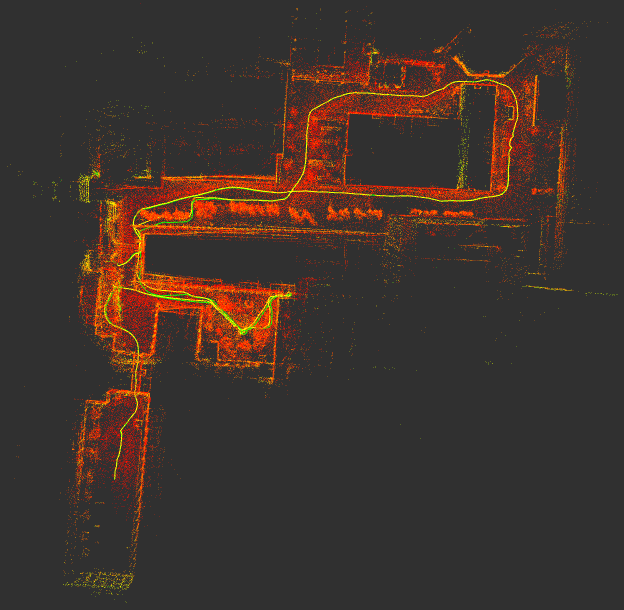
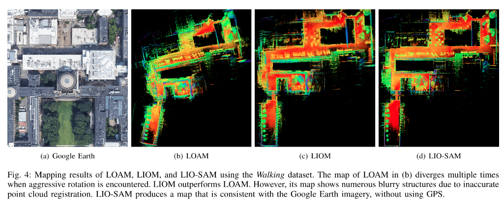
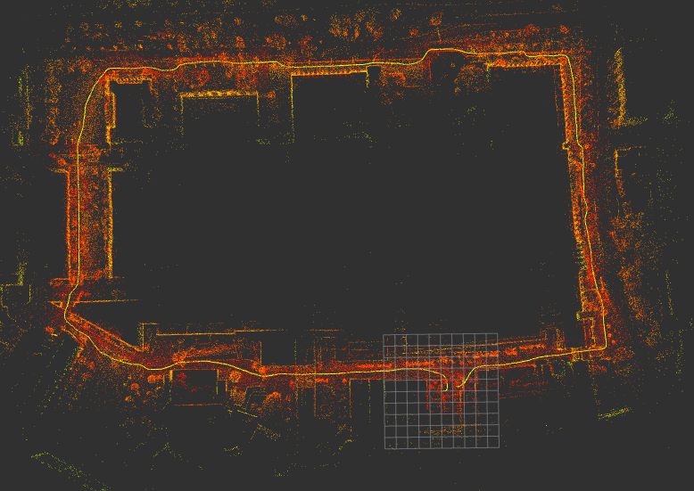
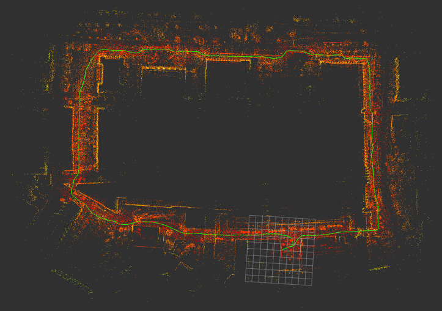
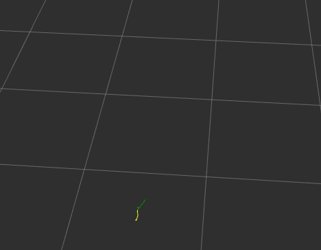
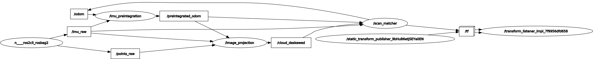

li_slam_ros2
====
  


This package is a combination of [lidarslam_ros2](https://github.com/rsasaki0109/lidarslam_ros2) and the [LIO-SAM](https://github.com/TixiaoShan/LIO-SAM) IMU composite method.

See LIO-SAM for IMU composites, otherwise see lidarslam_ros2.

 - Walking dataset(casual_walk.bag)


Yellow path: path without loop closure, Green path: modified path, Red: map

Reference(From the LIO-SAM paper)  
https://github.com/TixiaoShan/LIO-SAM/blob/master/config/doc/paper.pdf  


 - Campus dataset (large) demo(big_loop.bag)



Yellow path: path without loop closure, Red: map
(the 10x10 grids in size of 10m × 10m)



Green path: modified path with loop closure, Red: map


## requirement to build
You need  [ndt_omp_ros2](https://github.com/rsasaki0109/ndt_omp_ros2) and gtsam for scan-matcher

clone
```
cd ~/ros2_ws/src
git clone --recursive https://github.com/rsasaki0109/li_slam_ros2
```
gtsam install
```
sudo add-apt-repository ppa:borglab/gtsam-release-4.0
sudo apt update
sudo apt install libgtsam-dev libgtsam-unstable-dev
```
build
```
cd ~/ros2_ws
colcon build
```


## Walking dataset demo(casual_walk.bag)

The optimization pipeline in Lidar Inertial SLAM were taken from [LIO-SAM](https://github.com/TixiaoShan/LIO-SAM).

(Note: See the LIO-SAM repository for detailed settings regarding IMU.  
The other thing to note is that the speed will diverge if the voxel_grid_size is large.  

demo data(ROS1) in LIO-SAM   
https://github.com/TixiaoShan/LIO-SAM   
The Velodyne VLP-16 was used in this data.


```
rviz2 -d src/li_slam_ros2/scanmatcher/rviz/lio.rviz 
```

```
ros2 launch scanmatcher lio.launch.py
```

```
ros2 bag play -s rosbag_v2 walking_dataset.bag 
```



Green arrow: pose, Yellow path: path, Green path: path by imu 


Yellow path: path without loop closure, Green path: modified path, Red: map

rosgraph

  

`pose_graph.g2o` and `map.pcd` are saved in loop closing or using the following service call.

```
ros2 service call /map_save std_srvs/Empty
```

## Campus dataset (large) demo(big_loop.bag)

```
rviz2 -d src/li_slam_ros2/scanmatcher/rviz/lio_bigloop.rviz 
```

```
ros2 launch scanmatcher lio_bigloop.launch.py
```

```
ros2 bag play -s rosbag_v2 big_loop.bag 
```


Yellow path: path without loop closure, Red: map
(the 10x10 grids in size of 10m × 10m)


Green path: modified path with loop closure, Red: map


## Used Libraries 

- Eigen
- PCL(BSD3)
- g2o(BSD2 except a part)
- [ndt_omp](https://github.com/koide3/ndt_omp) (BSD2)
- gtsam(BSD2)
